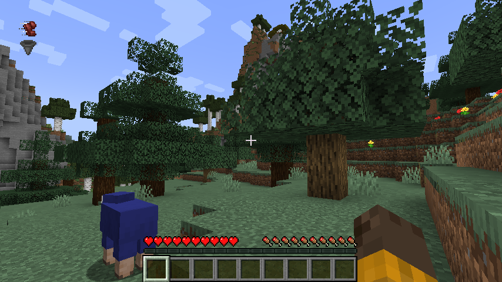

  

# Toggle Visualize
Visualize sprint and sneak toggling.  
When you sprint or sneak, it will be indicated by an icon and text.
Of course, it can also be disabled in the configuration.

## Dependencies
- Fabric API
- YetAnotherConfigLib
- Fabric Language Kotlin

---

